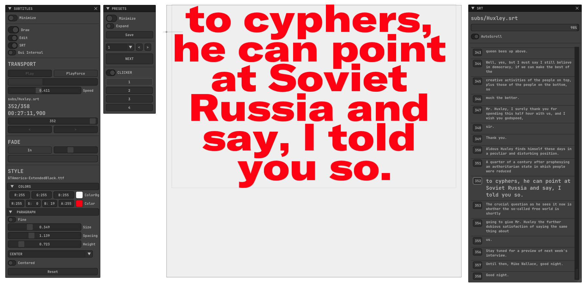
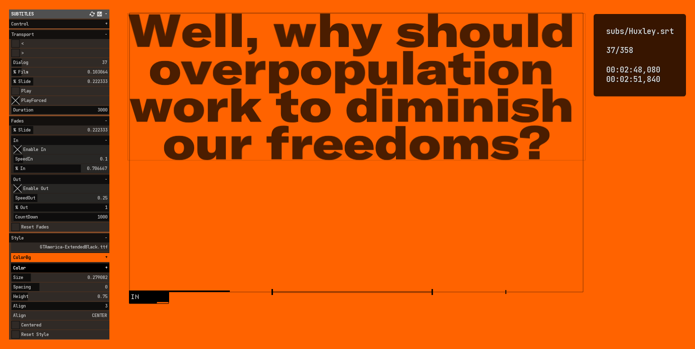
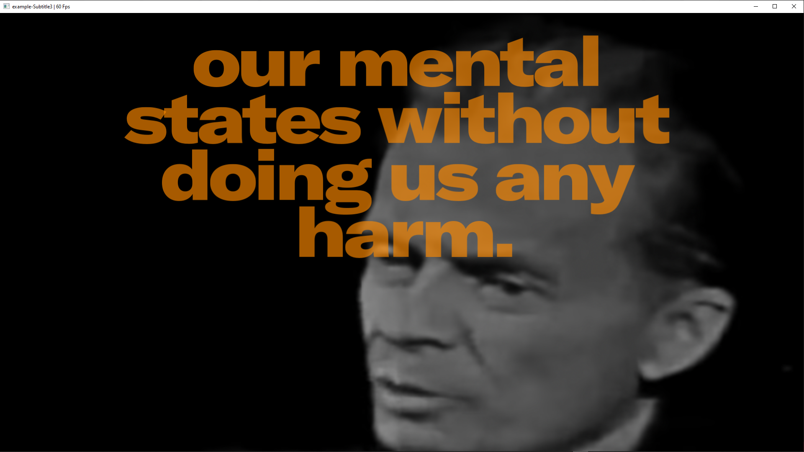
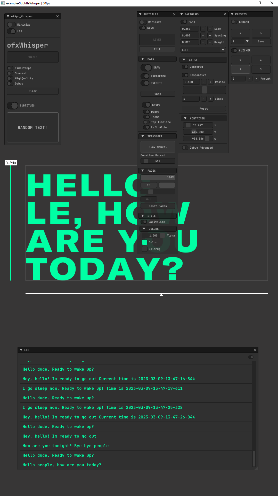
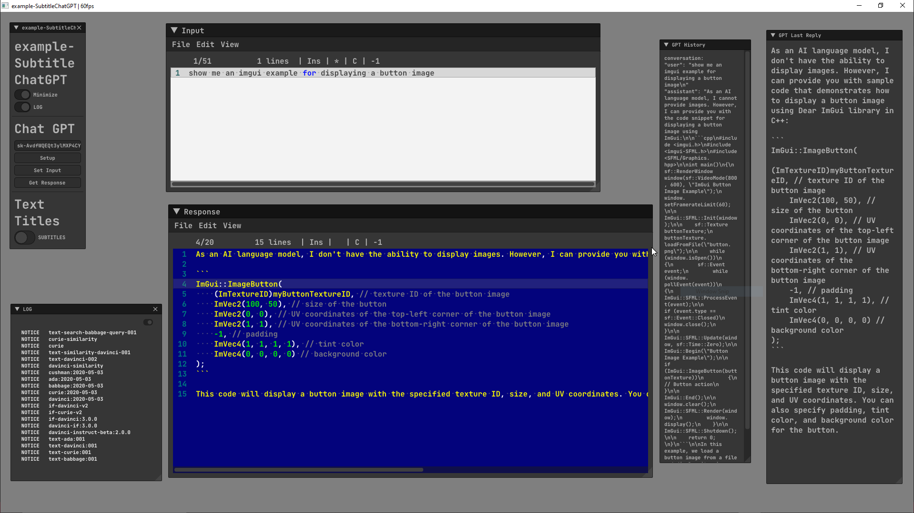

## OVERVIEW

Ready to use customizable `.SRT` text subtitle (and plain text) player for `openFrameworks`. 


## FEATURES

- Full `.SRT` file browser for exploring the dialogs.
- `Text Mode` for importing `.txt`. files. Split file in blocks then used as slides.
- Fast `FontStash` render.
- Custom `Paragraph Styles`.
- Scalable and draggable `rectangle container`.
- All `settings are persistent`.
- Animated `Fade In/Out` for transparency.
- `Transport time player` with four modes: 
	- **STANDALONE**  
	  - Dialogs following the original `SRT` times and durations.
	- **FORCED** 
	  - Customizable dialogs duration. Ignoring `SRT` times. Ideal for `Text` mode.
	- **EXTERNAL** 
	  - Time is controlled by a video player or linked to one external control.  
	- **MANUAL** 
	  - To work without loading any `SRT` file. Just pass the text slides manually.
- `Presets Engine` for all the settings. 
	
## SCREENCASTS

[VIDEO](https://youtu.be/kcObeooL3Pc)

<details>
  <summary>EXAMPLES / SCREENSHOTS</summary>

#### - example-Subs_ImGui 
<!--  -->

#### - example-Subs_ofxGui / ofxGui 


#### - example-Subs_ofxGui2 / ofxGui (Video Player) 


#### - example-SubtitleWhisper / Whisper (Real-time audio to text) [ ADVANCED / WIP ]  
  
Requires this [FORK](https://github.com/moebiussurfing/ofxWhisper) of [ofxWhisper](https://github.com/roymacdonald/ofxWhisper) from [@roymacdonald](https://github.com/roymacdonald).  

#### - example-SubtitleChatGPT / [ ADVANCED / WIP ]  
  


[VIDEO](https://youtu.be/G8iH-0UakN4)


</details>

## USAGE

#### ofApp.h
```.cpp
#include "ofxSurfingTextSubtitle.h"

ofxSurfingTextSubtitle subs;
```

#### ofApp.cpp
```.cpp
void ofApp::setup() 
{
	//subs.setup("Alphaville.srt"); // Optional
}
void ofApp::draw()
 {
	subs.draw();

	subs.drawGui();
}
```

## DEPENDENCIES
- [ofxFontStash](https://github.com/armadillu/ofxFontStash)
- [ofxSurfingBox](https://github.com/moebiussurfing/ofxSurfingBox)
- [ofxSurfingHelpers](https://github.com/moebiussurfing/ofxSurfingHelpers)
- [ofxSufingImGui](https://github.com/moebiussurfing/ofxSurfingImGui)

### OPTIONAL
- **ofxGui** / Optional (oF core)
- [ofxWhisper](https://github.com/moebiussurfing/ofxWhisper) / FORK (Only for the example)
- [ofxChatGPT](https://github.com/moebiussurfing/ofxChatGPT) / FORK (Only for the example)

### TODO
- List and load different render fonts files on runtime.  
- macOS testing.

## TESTED SYSTEM
* **Windows 10** / **VS 2022** / **OF ~0.11**

## THANKS
* SRT parser: file `srtparser.h`. Taken from https://github.com/Jonathhhan/ofEmscriptenExamples. Thanks to [@Jonathhhan](https://github.com/Jonathhhan). Originally by [@saurabhshri](https://github.com/saurabhshri/simple-yet-powerful-srt-subtitle-parser-cpp).  
* [ofxPlaybackGui](https://github.com/roymacdonald/ofxPlaybackGui) from [@roymacdonald](https://github.com/roymacdonald) bundled into `/libs`. Optional to use only when using **ofxGui** as GUI. (Can be removed when using **ofxSurfingImGui**.)
* [ofxWhisper](https://github.com/roymacdonald/ofxWhisper) from [@roymacdonald](https://github.com/roymacdonald). Powered by [whisper.cpp](https://github.com/ggerganov/whisper.cpp) from [@ggerganov](https://github.com/ggerganov).  
* [ofxChatGPT](https://github.com/tettou771/ofxChatGPT) from [@tettou771](https://github.com/tettou771).   

## LICENSE
**MIT LICENSE**