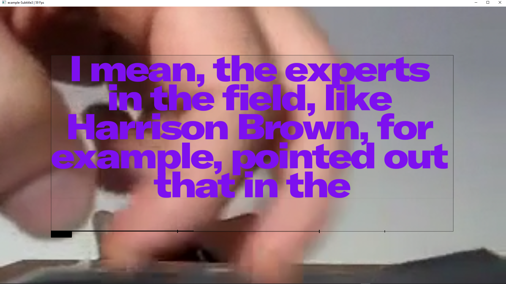
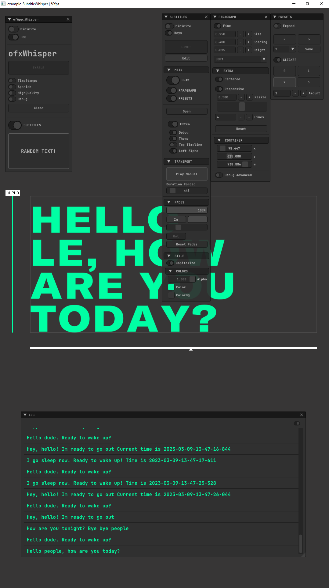

## OVERVIEW

Ready to use customizable `.SRT` text subtitle player for `openFrameworks`. 

## FEATURES

- Fast `FontStash` render.
- Custom `Paragraph Styles`.
- Scalable and draggable `container`.
- `Persistent` settings.
- Full `srt` file browser for exploring the dialogs.
- Animated `Fade In/Out` for transparency.
- Transport `Player` with 3 Modes: 
	- Standalone: Dialogs following the original `srt` times and durations.
	- Forced: Customizable dialogs duration. Ignoring `srt` times.
	- External: Time is controlled by a video player or linked to an external control. 
- `Presets` Engine for styles (Optional). 
	(Look `example-Subtitle2`. Requires ImGui.)
	
## SCREENCAST VIDEO

[VIDEO](https://youtu.be/kcObeooL3Pc)

## SCREENSHOTS

### Example-Subtitle / ofxGui 


### Example-Subtitle2 / ImGui (Optional) 


### Example-Subtitle3 / ofxGui (Video Player) 


### example-SubtitleWhisper / Whisper / ImGui (real-time audio to text) [ADVANCED]  
  
Requires this [FORK](https://github.com/moebiussurfing/ofxWhisper) of [ofxWhisper](https://github.com/roymacdonald/ofxWhisper) from [@roymacdonald](https://github.com/roymacdonald)  


## USAGE

#### ofApp.h
```.cpp
#include "ofxSurfingTextSubtitle.h"
// Remember to comment to use ofxGui only and to disable ImGui!
// #define USE_IM_GUI__SUBTITLES

ofxSurfingTextSubtitle subs;
```

#### ofApp.cpp
```.cpp
void ofApp::setup() {
	subs.setup("Alphaville.srt");
}
void ofApp::update() {
	subs.update();
}
void ofApp::draw() {
	subs.draw();
	subs.drawGui();
}
```

## DEPENDENCIES
- [ofxFontStash](https://github.com/armadillu/ofxFontStash)
- [ofxSurfingBox](https://github.com/moebiussurfing/ofxSurfingBox)
- [ofxSurfingHelpers](https://github.com/moebiussurfing/ofxSurfingHelpers)
- ofxGui / oF core

### OPTIONAL
- [ofxSufingImGui](https://github.com/moebiussurfing/ofxSurfingImGui)

### TODO
- List and load render fonts files on runtime.

## TESTED SYSTEM
* **Windows 10** / **VS 2017** / **OF ~0.11**

## THANKS
* SRT parser: file `srtparser.h` taken from https://github.com/Jonathhhan/ofEmscriptenExamples.  
Thanks `@Jonathhhan`.  
Originally by https://github.com/saurabhshri/simple-yet-powerful-srt-subtitle-parser-cpp.  
* [ofxPlaybackGui](https://github.com/roymacdonald/ofxPlaybackGui) from [@roymacdonald](https://github.com/roymacdonald) bundled into `/libs`. Optional to use only when using ofxGui as GUI. (Can be removed when using ofxSurfingImGui.)
* [ofxWhisper](https://github.com/roymacdonald/ofxWhisper) from [@roymacdonald])(https://github.com/roymacdonald). Powered by [whisper.cpp](https://github.com/ggerganov/whisper.cpp)  

## LICENSE
**MIT License**