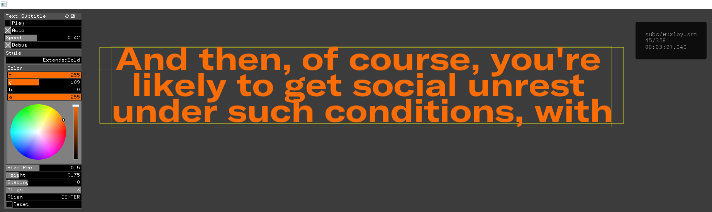
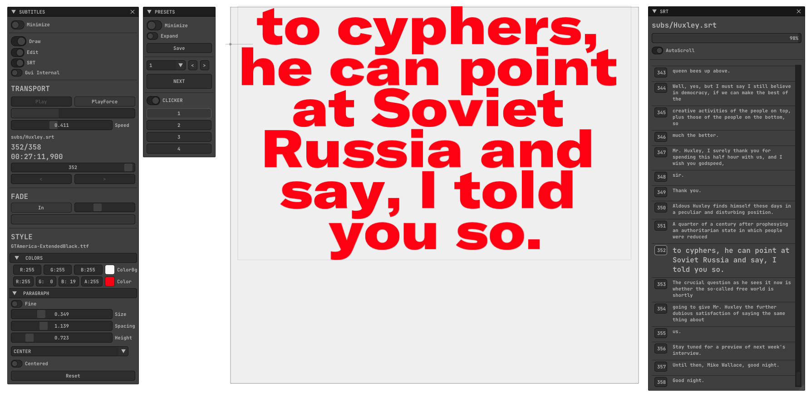

## Screenshot
#### ofxGui 

#### ImGui (Optional) 


## Features
- Fast FontStash render.
- Custom Styles.
- Scalable and draggable container.
- Transport player and browser.
- Persistent settings.
- Presets Engine.
- Animated Fade In.

## Example
#### ofApp.h
```.cpp
#include "ofxSurfingTextSubtitle.h"
ofxSurfingTextSubtitle sub;
```

#### ofApp.cpp
```.cpp
void ofApp::setup() 
{
	sub.setup("Alphaville.srt");
}
void ofApp::update() 
{
	sub.update();
}
void ofApp::draw() 
{
	sub.draw();
	sub.drawGui();
}
```

## Dependencies
- ofxFontStash
- ofxSurfingBox
- ofxSurfingHelpers
- ofxGui
#### OPTIONAL
- ofxSufingImGui

### TODO
- Pass time to link with an external video player.

## Tested Systems
* **Windows 10** / **VS 2017** / **OF ~0.11**

## Thanks
`srtparser.h` taken from https://github.com/Jonathhhan/ofEmscriptenExamples. Thanks @Jonathhhan.

## License
**MIT License**